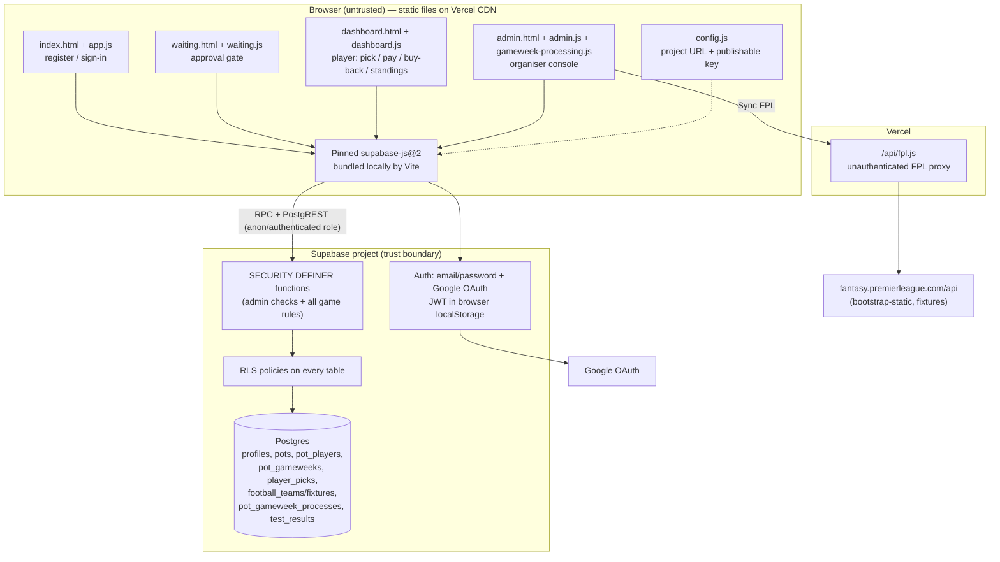

# Last Man Standing — Repository Audit

**Audited commit:** `9bea7cc` (branch `main`), working tree clean
**Audit date:** 2026-08-20
**Auditor role:** Principal architect / senior frontend / app-sec / QA / a11y review (read-only pass — no files modified)
**Scope:** Entire repository — 5 HTML pages, 4 browser ES-module scripts, 1 Vercel serverless function, 23 Supabase SQL modules, 17 CSS files, config and deployment files, and full git history.

> **Premise correction (read this first).** The brief frames the app as "React + Vite." **It is not.** There is no React, no Vite, no bundler, no `package.json`, no build step, and no TypeScript anywhere in the repo (verified: a full-tree grep for `react|vite|webpack|jsx` returns nothing). The application is **hand-written vanilla HTML + ES-module JavaScript** loading `@supabase/supabase-js@2` from the `esm.sh` CDN at runtime, deployed as static files on Vercel, with a single Node serverless function ([api/fpl.js](api/fpl.js)) proxying the Fantasy Premier League feed. **All game logic and authorization live in Postgres (Supabase) `SECURITY DEFINER` functions and Row Level Security policies.** The framework verdict in §3 is written against what actually exists.

> **Current local state — Security Phase 1, 2026-08-20.** The paragraph above records the original audited state at commit `9bea7cc`. Local, uncommitted remediation has since added Vite, a pinned package manifest and lockfile, Vitest/jsdom tests, a locally bundled Supabase client, safe DOM renderers, and security-header configuration. LMS-01: **Resolved locally and independently verified.** LMS-06: **Implemented and statically verified; live Vercel enforcement pending preview verification.** This working tree is ready to commit, but has not been committed, pushed, preview-deployed, or production-verified.

---

## 1. Executive summary

This is a small, single-organiser "Last Man Standing" football elimination competition for a private group, for the 2026/27 Premier League season. Its standout architectural decision is genuinely sound and rare in hobby projects: **the browser is treated as untrusted, and every game rule and permission check is enforced server-side** inside Postgres functions guarded by `is_current_user_admin()` and Row Level Security. Money is real but handled **offline** (players pay the organiser directly; the admin marks payment status) — the app never touches card data.

The original audit found a Critical stored XSS vulnerability. Security Phase 1 has resolved it locally and independent review approved the remediation. The remaining launch-blocking domain-correctness gaps are unchanged: result processing is irreversible, postponed/abandoned matches deadlock a gameweek, and there is no tie-break when the last players are eliminated together. Security-focused automated tests and build tooling now exist, but broader application, database, accessibility, and end-to-end coverage remains limited; there is still no CI.

**Recommended direction:** *Keep the vanilla-JS + Supabase architecture, but restructure specific areas and close the correctness/security gaps before any real-money launch.* A React/Next.js rewrite is **not** warranted — see §3.

### Launch readiness: **Not ready** for a real-money competition. Security Phase 1 is ready to commit and then preview-deploy for CSP verification; it has not been production-verified.

### Ratings (1 = poor, 5 = excellent)

| Dimension | Score | One-line rationale |
|---|---|---|
| Architecture | **3 / 5** | Excellent trust boundary (logic in DB, thin client) offset by dense single-line files and fragile hand-run migrations. |
| Maintainability | **3 / 5** | Build/test tooling and shared safe renderers now exist; dense modules, duplicated SQL definitions, and no types/CI remain. |
| Security | **3 / 5** | Stored XSS and runtime CDN exposure are remediated locally; CSP is statically verified but awaits Vercel preview enforcement, and auth hardening remains. |
| Data integrity | **2 / 5** | Good DB constraints and idempotent processing, but irreversible results, no postponed handling, no manual correction, cross-season ID collision, no tie-break. |
| Test coverage | **2 / 5** | Security Phase 1 has focused XSS, URL, sink, CSP, build, and entry smoke coverage; competition/database/E2E coverage remains largely absent. |
| Accessibility | **2 / 5** | `:focus-visible` and some `aria-live` present, but status-by-colour, no reduced-motion, unlabeled scoreboards, dialog focus concerns. |
| Performance | **3 / 5** | Fine for a small private group; the runtime CDN is gone, while per-pot request fan-out and an always-on 1 s timer remain. |
| Production readiness | **2 / 5** | Security tests/build tooling now exist, but no CI/monitoring/migration tooling and multiple launch-blocking correctness gaps remain. |

**Principal strengths:** server-authoritative rules; comprehensive RLS on every table; DB-level uniqueness preventing double-picks and team reuse; idempotent gameweek processing with an advisory lock; sensible privacy (co-players' picks hidden until the deadline; emails hidden from non-admins).

**Largest remaining risks:** (1) irreversible processing + no result-correction/restore path; (2) postponed/abandoned fixtures deadlock a gameweek; (3) no tie/co-elimination resolution; (4) regulatory exposure; (5) live CSP enforcement is unverified until a Vercel preview checklist passes.

---

## 2. System map

**Trust boundaries.** The only trusted tier is Supabase Postgres. Everything in the browser (including the admin console) is untrusted and re-validated server-side. `api/fpl.js` is a thin, fixed-URL proxy with no user input.

**Major data flows.** (1) Sign-up → Auth trigger creates a `profiles` row (`approved=false`). (2) Admin approves → adds to a pot → confirms payment. (3) Player confirms one team per gameweek via `confirm_team_pick`. (4) Admin syncs FPL results, then `process_pot_gameweek` resolves outcomes and eliminates. (5) Standings read back through privacy-filtered functions.

**Undeterminable from code:** the production Vercel domain, whether Supabase email confirmation is enforced, Auth rate-limit configuration, how the first admin's `is_admin` flag is set (no function does it — presumably manual SQL), and any legal/regulatory posture.

---

## 3. Framework verdict

**Verdict: (2) Keep the current stack, but restructure specific areas.** Do **not** migrate frameworks to launch.

The instinct behind the brief ("is React + Vite right?") doesn't apply, because the app deliberately avoids a frontend framework. The important question is whether the **vanilla-JS-thin-client + Supabase-as-backend** shape fits this product. For a private, single-organiser competition with a handful to low-hundreds of players, it fits well: the security-sensitive logic is server-side where it belongs, hosting is trivial (static files + one function), and there is no server to operate.

What it does *not* need and does not have: SEO/social-share rendering (the app is entirely behind auth), SSR/SSG, or a rich routing/data-loading layer. Those are the main reasons to reach for Next.js/Remix, and none apply here.

The original audit identified missing build and test hygiene. Security Phase 1 now provides Vite bundling, exact dependency pins, a lockfile, and Vitest/jsdom; type safety, linting, CI, and comprehensive application coverage remain future work.

### Decision matrix

| Option | Benefits | Costs | Migration risk | Operational trade-off | Warranted? |
|---|---|---|---|---|---|
| **Keep vanilla + Supabase, add tooling** (recommended) | Keeps the sound trust model; adds Vite/esbuild bundling, a pinned lockfile, TypeScript, Vitest/Playwright, ESLint. Fixes the CDN-dependency and testability gaps. | Introduce a build step; moderate refactor of the dense scripts into modules. | **Low** | Still static hosting + one function. | **Yes** |
| **React + Vite (SPA) with the same Supabase backend** | Component model eases the growing dashboard/admin DOM code; ecosystem for forms, a11y, state. | Full frontend rewrite; larger bundle; no product capability gained (still client-only, still needs the SQL layer). | Medium–High | Same hosting; more build complexity. | No — not before launch |
| **Next.js / Remix (SSR framework)** | Server routes for scheduled result ingestion and webhooks; server-side auth; SEO if ever public. | Rewrite + a server runtime to operate; overkill for an auth-gated private game; duplicates logic already in Postgres. | High | New server/runtime surface, more ops. | No |
| **Full rewrite (any framework)** | — | Discards a working, server-authoritative design. | High | — | **No — no evidence justifies it** |

**Remaining restructure targets (stack unchanged):** type/lint the dense modules, expand tests, and consolidate duplicated SQL function definitions into ordered idempotent migrations. The build/bundle step, pinned Supabase client, and shared safe DOM helpers are implemented locally.

---

## 4. Findings register

Ordered by risk. IDs are stable references for triage.

---

### LMS-01 — Stored XSS via player display name reaches the admin session
> **Remediation note — 2026-08-20: Resolved in security phase 1.** Dynamic markup construction in Admin Pots, Admin Picks, Admin Standings, player standings, and the processing summary was replaced with explicit DOM construction and `textContent`. Dynamic badge URLs are constrained to HTTPS on the application origin or the Premier League badge origin. Automated regression tests cover malicious names/emails, malformed markup, event-handler payloads, long/Unicode values, URL schemes, and both admin/player standings helpers. The production build and smoke checks passed.

- **Severity:** Critical · **Confidence:** High · **Category:** Security (OWASP A03 Injection / A07)
- **Evidence:** User-controlled name/email fields are interpolated into `innerHTML` without escaping:
  - Admin console (executes in the **organiser's** browser): [admin.js:26](admin.js#L26) (`playerName`, `player.email`), [admin.js:30](admin.js#L30), [admin.js:50](admin.js#L50) (`player.name`, `player.email`), [admin.js:56](admin.js#L56) (`player.name`).
  - Player dashboard (executes in **co-players'** browsers): [dashboard.js:25](dashboard.js#L25) (`player.name`).
  - The value originates from attacker-supplied sign-up metadata: [app.js:37-41](app.js#L37-L41) writes `first_name`/`last_name`/`full_name` verbatim; the trigger copies them into `profiles` ([setup.sql:20-42](supabase/setup.sql#L20-L42)); `get_pot_standings` / `get_admin_pick_overview` return them as `name` ([player_standings.sql:19](supabase/player_standings.sql#L19), [admin_pick_overview.sql:15](supabase/admin_pick_overview.sql#L15)).
  - No Content-Security-Policy is set ([vercel.json](vercel.json) has only `cleanUrls`/`trailingSlash`), so nothing mitigates it.
  - Note: the admin **Players** tab itself uses `textContent` and is safe ([admin.js:16-18](admin.js#L16-L18)) — but the **Pots**, **Picks**, and **Standings** tabs and the create-pot form are not.
- **Why it matters:** The Supabase session JWT lives in `localStorage`; script running in the admin's page can read it and invoke every admin RPC (approve players, mark payments paid, process gameweeks, crown winners) as the organiser. That is full competition takeover.
- **Attack scenario:** A user registers with first name ``. Once the organiser approves them and opens the Pots/Picks/Standings tab (routine actions), the payload fires in the admin session. A co-player variant fires in every pot member's dashboard once standings are visible.
- **Remediation:** Stop building DOM from HTML strings for any dynamic value. Replace `innerHTML` string-building with `textContent`/`createElement` (the codebase already has a safe `addText` helper — [dashboard.js:10](dashboard.js#L10) — use it everywhere), or add and apply an `escapeHtml()` helper. Add a strict CSP response header (`default-src 'self'`; explicitly allow only required origins). Optionally constrain name characters at sign-up.
- **Effort:** M · **Blocks launch:** **Yes** · **Ref:** OWASP ASVS V5.3, Top 10 A03.

---

### LMS-02 — Gameweek processing is irreversible; no way to correct results or restore a wrongly-eliminated player
- **Severity:** High · **Confidence:** High · **Category:** Data integrity / Domain correctness
- **Evidence:** `process_pot_gameweek` writes outcomes + eliminations and inserts a `pot_gameweek_processes` row guarded by a unique PK and advisory lock; re-running raises "already been processed" ([gameweek_processing.sql:36-100](supabase/gameweek_processing.sql#L36-L100)). The only reversal, `reset_test_gameweek`, requires `status='draft' AND test_mode` and only touches test runs ([gameweek_processing.sql:106-118](supabase/gameweek_processing.sql#L106-L118)). There is **no** production function to correct a fixture score, override a pick outcome, or un-eliminate a player.
- **Why it matters:** The brief explicitly asks "can a correction restore an eliminated player?" — in production, **no**. If FPL publishes a wrong/provisional score, or a match is later voided, a live pot is permanently corrupted with no in-app recovery short of raw SQL.
- **Scenario:** FPL marks a fixture `finished` with a provisional score; admin processes; the score is later corrected. The eliminated player has no recourse; the admin cannot reopen the gameweek.
- **Remediation:** Add an admin-only, audited `reverse_pot_gameweek(pot, gw)` that reverts outcomes to `pending`, restores `active` for players eliminated *solely* by that gameweek, and deletes the process row — with guards against reversing when a later gameweek is already processed. Record who/when/why.
- **Effort:** M · **Blocks launch:** **Yes**.

---

### LMS-03 — Postponed / abandoned / cancelled fixtures deadlock a gameweek in production
- **Severity:** High · **Confidence:** High · **Category:** Domain correctness / Provider reconciliation
- **Evidence:** Production readiness requires every relevant fixture to be `finished` with non-null scores; otherwise `unavailable_count > 0` blocks processing ([gameweek_processing.sql:41-51](supabase/gameweek_processing.sql#L41-L51)). The `postponed` outcome is only reachable through **test mode** ([gameweek_processing.sql:56-58,82-84](supabase/gameweek_processing.sql#L56-L58)). A real postponed fixture never becomes `finished`, so the gameweek can never be processed and the pot stalls indefinitely. Random assignment is likewise blocked until all fixtures are final ([random_pick_setup.sql:23-25](supabase/random_pick_setup.sql#L23-L25), [pick_deadlines.sql:64-65](supabase/pick_deadlines.sql#L64-L65)).
- **Why it matters:** Postponements are routine in English football (weather, cup congestion). One postponed match involving any picked team halts the entire round for everyone.
- **Remediation:** Allow the admin to mark a fixture postponed/void in production (not just test mode) and define the rule (LMS convention is usually "postponed pick survives to re-pick or carries"). Let processing proceed for resolved fixtures while flagging unresolved picks as `postponed` rather than blocking.
- **Effort:** M · **Blocks launch:** **Yes**.

---

### LMS-04 — No tie-break / resolution when the last active players are eliminated together
- **Severity:** High · **Confidence:** High · **Category:** Domain correctness / Game completeness
- **Evidence:** `complete_pot_with_winner` requires **exactly one** active player ([tournament_operations.sql:35-37](supabase/tournament_operations.sql#L35-L37)), and the UI only offers "Crown winner" when `active.length===1` ([admin.js:35](admin.js#L35)). If the final two (or more) all lose/draw in the same gameweek, zero players remain active and there is no path to complete, split, or roll over the pot.
- **Why it matters:** Simultaneous elimination of all survivors is a defining LMS edge case, especially with the house rule that **a draw eliminates** (LMS-11). With real prize money, an unresolvable pot is a payout dispute.
- **Remediation:** Define and implement the tie rule (rollover to next gameweek among the co-eliminated, or split the pot). Add an admin resolution action for the 0-active state.
- **Effort:** M · **Blocks launch:** **Yes** (for money) / High otherwise.

---

### LMS-05 — Cross-season fixture/team ID collision corrupts prior-season data
- **Severity:** High · **Confidence:** Medium (schema-certain; impact triggers on a second season) · **Category:** Data integrity
- **Evidence:** `football_fixtures.fpl_fixture_id` and `football_teams.fpl_team_id` are **globally** unique, not per-season ([fpl_fixture_setup.sql:6,16](supabase/fpl_fixture_setup.sql#L6-L16)), and `sync_fpl_data` upserts `ON CONFLICT (fpl_fixture_id) DO UPDATE ... season=excluded.season` ([fpl_fixture_setup.sql:56-67](supabase/fpl_fixture_setup.sql#L56-L67)). FPL fixture IDs restart each season (confirmed against FPL API references). Syncing a new season overwrites last season's fixtures — flipping their `season` and scores — and any completed pot referencing them by season string is retroactively corrupted.
- **Why it matters:** The season is hardcoded `2026/27` today, so it is latent; it becomes a live corruption the first time a 2027/28 sync runs against the same project.
- **Remediation:** Make uniqueness `(season, fpl_fixture_id)` and `(season, fpl_team_id)`; scope the upsert conflict target to include season; join picks to fixtures by the internal `id` (already the case) but archive/segregate seasons.
- **Effort:** S–M · **Blocks launch:** No (single-season) — **fix before season 2**.

---

### LMS-06 — No Content-Security-Policy or hardening headers; runtime CDN dependency
> **Remediation note — 2026-08-20: Implemented and statically verified; live Vercel enforcement pending preview verification.** The dependency/CDN portion is resolved: Supabase is pinned in `package.json`/`package-lock.json`, bundled locally by Vite, and no runtime `esm.sh` import remains. `vercel.json` contains a statically tested CSP plus `nosniff`, referrer, and permissions headers. Build, tests, online dependency audit, configuration checks, and local entry-point smoke checks passed. Actual response-header enforcement, OAuth, Supabase requests/WebSockets, badges, and `/api/fpl` still require a Vercel preview checklist.

- **Severity:** Medium · **Confidence:** High · **Category:** Security / Supply chain
- **Evidence:** [vercel.json](vercel.json) sets no headers. The Supabase client is imported at runtime from `https://esm.sh/@supabase/supabase-js@2` on every page — unpinned to a patch, no Subresource Integrity, no lockfile. A compromised or spoofed CDN response executes with full app privileges.
- **Why it matters:** No CSP removes the main defence-in-depth against LMS-01 and against a CDN supply-chain compromise; missing `X-Frame-Options`/`frame-ancestors` allows clickjacking of the admin page.
- **Remediation:** Add a `headers` block (CSP `default-src 'self'`, `frame-ancestors 'none'`, `X-Content-Type-Options: nosniff`, `Referrer-Policy`). Vendor/self-host the Supabase client via a pinned dependency + build step, or at minimum pin an exact version.
- **Effort:** S · **Blocks launch:** No (strongly recommended alongside LMS-01).

---

### LMS-07 — Real-money paid-entry competition with no regulatory / legal posture
- **Severity:** High · **Confidence:** Medium (legal, not code) · **Category:** Compliance / Privacy
- **Evidence:** Entry and buy-back fees are first-class (`entry_fee_pence`, `buy_back_fee_pence` — [pot_setup.sql:8-9](supabase/pot_setup.sql#L8-L9)); the UI collects money offline ("Pay the admin" — [dashboard.js:7](dashboard.js#L7)). Personal data collected includes email and mobile number ([setup.sql:6-8](supabase/setup.sql#L6-L8)). No privacy policy, terms, consent record, data-export, or deletion mechanism exists in the repo.
- **Why it matters:** In Great Britain a paid-entry Last Man Standing with cash prizes is generally licensable gambling under the Gambling Act 2005 unless it qualifies for a specific exemption (e.g. certain private/work lotteries or genuinely free entry). Separately, UK GDPR obliges lawful basis, retention limits, and data-subject rights for the stored email/phone.
- **Remediation:** Take legal advice on the exemption/licence question before charging entry; add terms, a privacy notice, and a data-deletion path. If it must stay unregulated, consider free-to-play.
- **Effort:** M (mostly non-engineering) · **Blocks launch:** **Yes for paid play** (business decision).

---

### LMS-08 — No audit trail for money-affecting admin actions
- **Severity:** Medium · **Confidence:** High · **Category:** Data integrity / Auditability
- **Evidence:** `pot_gameweek_processes` records `processed_by`/`processed_at` for processing ([gameweek_processing.sql:4-12](supabase/gameweek_processing.sql#L4-L12)) — good — but payment status changes ([pot_setup.sql:106-121](supabase/pot_setup.sql#L106-L121)), approvals ([admin_setup.sql:15-24](supabase/admin_setup.sql#L15-L24)), buy-back decisions ([buy_back_setup.sql:35-53](supabase/buy_back_setup.sql#L35-L53)), player add/remove, and status changes leave **no history**.
- **Why it matters:** With real money, "who marked me paid / eliminated / removed me?" must be answerable. Overwrites are silent.
- **Remediation:** Add an append-only `admin_audit` table written by each admin function (actor, action, target, before/after, timestamp).
- **Effort:** M · **Blocks launch:** No (High value for paid play).

---

### LMS-09 — Weak authentication controls (password policy, enumeration, rate limiting)
- **Severity:** Medium · **Confidence:** Medium · **Category:** Security (A07)
- **Evidence:** Password policy is `minlength=8` with no complexity/breach check ([index.html:24](index.html#L24)); no CAPTCHA/rate-limit is configured in-repo (Supabase provides some defaults, but they are not evidenced here). Registration is open to anyone (they land unapproved). Mobile number is stored though "SMS 2FA is not active" ([index.html:25](index.html#L25)).
- **Why it matters:** Brute-force/credential-stuffing and account-enumeration exposure for an app holding money state; collecting a phone number with no stated use is data minimisation risk.
- **Remediation:** Enable Supabase Auth rate limiting + bot protection, enforce email confirmation, raise password strength (or rely on OAuth), and either use or stop collecting the phone number.
- **Effort:** S–M · **Blocks launch:** No.

---

### LMS-10 — Hand-run SQL migrations: duplicated definitions, undocumented ordering, stale README
- **Severity:** Medium · **Confidence:** High · **Category:** Architecture / Operability
- **Evidence:** Several functions are redefined across modules and only the last-applied wins: `get_my_dashboard` in [player_dashboard_setup.sql](supabase/player_dashboard_setup.sql), [fix_multiple_player_pots.sql](supabase/fix_multiple_player_pots.sql), [buy_back_setup.sql:55-81](supabase/buy_back_setup.sql#L55-L81); `get_pot_selection` in [player_pick_setup.sql](supabase/player_pick_setup.sql) and [round_progression.sql](supabase/round_progression.sql); `get_pot_standings` in three modules (19/21/22); `confirm_team_pick` in 10 and 20; `assign_random_missing_picks` in 16 and 20. Two files both label themselves "10". The [README.md:8](README.md#L8) install order lists only through `player_pick_setup` and omits modules 11–23, and orders `fix_multiple_player_pots` before `fpl_fixture_setup` contradicting the numeric prefixes.
- **Why it matters:** A fresh environment (staging, disaster recovery) rebuilt from these files in the wrong order silently gets an older function definition — e.g. a `confirm_team_pick` without deadline enforcement. There is no way to verify the deployed schema matches the repo.
- **Remediation:** Adopt Supabase CLI migrations (ordered, checksummed, replayable), or renumber into one idempotent sequence and update the README to list every module.
- **Effort:** M · **Blocks launch:** No (High operational risk).

---

### LMS-11 — "Draw eliminates" rule is implemented but unstated to players
- **Severity:** Medium · **Confidence:** High · **Category:** Domain correctness / UX
- **Evidence:** A draw is scored as `lost` in processing ([gameweek_processing.sql:60,86](supabase/gameweek_processing.sql#L60)) and previews ([test_result_setup.sql:77-78](supabase/test_result_setup.sql#L77-L78)) — a deliberate house rule (commit "Treat draws as LMS eliminations"). But no player-facing screen states "a draw eliminates you"; the pick UI shows only fixtures and form.
- **Why it matters:** LMS variants differ on draws. An unannounced elimination-on-draw rule will feel unfair and produce disputes with money at stake.
- **Remediation:** State the rule prominently on the pick screen and in terms; confirm it is the intended rule.
- **Effort:** XS · **Blocks launch:** No (but cheap and important).

---

### LMS-12 — Client fixture availability can diverge from the whole-gameweek server deadline
- **Severity:** Low · **Confidence:** Medium · **Category:** UX / Correctness
- **Evidence:** The server locks *all* picks for a gameweek at the first fixture's kickoff (`deadline = min(kickoff_at)` — [pick_deadlines.sql:34-36](supabase/pick_deadlines.sql#L34-L36)). The client mostly mirrors this via `deadline_passed`, but the per-button disable also re-checks each fixture individually ([dashboard.js:15](dashboard.js#L15)). The mixed conditions are easy to break in future edits into a state where a late-kickoff team looks pickable after the gameweek deadline; the server still (correctly) rejects it, yielding a confusing error.
- **Why it matters:** Minor now (server is authoritative), but a latent UX trap.
- **Remediation:** Drive button state solely from the single server `deadline_passed` flag; drop the redundant per-fixture time check.
- **Effort:** XS · **Blocks launch:** No.

---

### LMS-13 — Standings "×" after-elimination marker mislabels bought-back active players
- **Severity:** Low · **Confidence:** Medium · **Category:** UX correctness
- **Evidence:** Admin standings mark any empty cell after a `lost` as after-elimination `×` ([admin.js:56](admin.js#L56)); a bought-back player is `active` again but still carries the earlier `lost`, so gameweeks between the loss and their next pick render `×` despite being active.
- **Remediation:** Gate the `×` on current `player_status` and the absence of a later reinstatement, not merely a prior `lost`.
- **Effort:** S · **Blocks launch:** No.

---

### LMS-14 — Serverless FPL proxy is unauthenticated and leaks error detail
- **Severity:** Low · **Confidence:** High · **Category:** Security / Abuse
- **Evidence:** [api/fpl.js](api/fpl.js) is open to anyone and returns `detail: error.message` on failure ([api/fpl.js:19](api/fpl.js#L19)). No SSRF (URL is fixed), but it is a free public FPL proxy and a minor info leak.
- **Remediation:** Require an authenticated Supabase JWT (admin) or a shared secret; drop internal error detail from the response.
- **Effort:** S · **Blocks launch:** No.

---

### LMS-15 — Accessibility gaps against WCAG 2.2 AA
- **Severity:** Medium · **Confidence:** Medium · **Category:** Accessibility
- **Evidence:** No `prefers-reduced-motion` anywhere (verified across all CSS) though hover transforms/animations exist ([styles.css:1](styles.css#L1)); status is conveyed by colour classes (`won`/`lost`/`pending`) on scoreboard cells with the outcome word sometimes only in a `title`/small text ([admin.js:56](admin.js#L56), [dashboard.js:25](dashboard.js#L25)); scoreboard `<table>`s lack `scope`/`caption`; the pick `<dialog>` ([dashboard.html:20-31](dashboard.html#L20-L31)) has no explicit focus management on open/close; countdown timers update every second without a reduced-motion/`aria` consideration ([dashboard.js:14](dashboard.js#L14)); some emblem `` use `alt=""` which is fine but team identity then depends on adjacent text.
- **Remediation:** Add a reduced-motion block; ensure every status has a non-colour cue (icon/text); add `scope="col"`, `<caption>`; manage dialog focus and restore; verify contrast of the muted greys (`#7f887e`, `#899187`) on dark backgrounds meets 4.5:1.
- **Effort:** M · **Blocks launch:** No.

---

### LMS-16 — Per-pot request fan-out and always-on 1 s timer
- **Severity:** Low · **Confidence:** High · **Category:** Performance
- **Evidence:** Rendering a pot fires several RPCs (`get_pot_selection`, `get_my_team_availability`, `get_gameweek_deadline`, `get_my_pot_history`, `get_pot_standings`) per pot ([dashboard.js:22,32](dashboard.js#L22-L32)); a global `setInterval(updateCountdowns,1000)` runs regardless of whether a countdown is visible ([dashboard.js:14](dashboard.js#L14)).
- **Why it matters:** Fine at small scale; a request waterfall and needless timer churn as pots/players grow.
- **Remediation:** Batch per-pot data into one RPC; only run the timer when a live deadline is on-screen; consider Supabase Realtime for standings instead of re-fetching.
- **Effort:** M · **Blocks launch:** No.

---

### LMS-17 — Non-friendly errors on concurrent/duplicate pick submission
- **Severity:** Informational · **Confidence:** High · **Category:** Data integrity (positive) / UX
- **Evidence:** Double-pick and team-reuse are correctly prevented by DB constraints `unique(pot_id,player_id,gameweek_number)` and `unique(pot_id,player_id,team_id)` ([player_pick_setup.sql:14-15](supabase/player_pick_setup.sql#L14-L15)); two racing submissions resolve safely, but the loser surfaces a raw Postgres unique-violation string rather than the friendly "already locked" message.
- **Remediation:** Catch `unique_violation` in `confirm_team_pick` and re-raise the friendly message. Integrity is already sound.
- **Effort:** XS · **Blocks launch:** No.

---

## 5. Domain and rules review

**Implemented rules (as built):**
- One competition = a **pot** with an entry fee, a one-time buy-back fee, a contiguous gameweek range ending at GW38, and an assigned set of approved players ([pot_setup.sql](supabase/pot_setup.sql), [admin.js:64](admin.js#L64)).
- Each gameweek a paid, active player locks **one team**; a team may be used **at most once per pot**; picks lock at the **first kickoff of the gameweek** ([player_pick_setup.sql](supabase/player_pick_setup.sql), [pick_deadlines.sql](supabase/pick_deadlines.sql)).
- Win → survive; **loss or draw → eliminated** ([gameweek_processing.sql:60](supabase/gameweek_processing.sql#L60)).
- Missing picks after the deadline can be **randomly assigned** (admin-triggered, unused teams only) ([pick_deadlines.sql:47-86](supabase/pick_deadlines.sql#L47-L86)).
- A single **one-time buy-back** reactivates an eliminated player if claimed before the next gameweek's deadline and approved by the admin ([buy_back_setup.sql](supabase/buy_back_setup.sql)).
- Pot completes when exactly one active player remains and the admin crowns them ([tournament_operations.sql:24-46](supabase/tournament_operations.sql#L24-L46)).
- **Pick privacy:** co-players see a pick only after that gameweek's deadline/processing; non-admins never see emails/payment ([player_standings.sql:20-33](supabase/player_standings.sql#L20-L33), [standings_window.sql](supabase/standings_window.sql)).

**Contradictions / ambiguities / missing protections:**
- **No result correction or reversal** in production (LMS-02) — the biggest domain gap.
- **Postponed/abandoned** matches unhandled outside test mode (LMS-03).
- **Co-elimination / final tie** has no resolution (LMS-04).
- **Draw-eliminates** is unstated to players (LMS-11).
- **Buy-back timing:** the deadline is the *next scheduled pot gameweek's* first kickoff ([buy_back_setup.sql:21-27](supabase/buy_back_setup.sql#L21-L27)); if the eliminating gameweek is the last, `next_gameweek` is null → "deadline not available yet" and no buy-back is possible. Confirm this is intended.
- **Random pick after a postponement** could assign a team whose fixture never resolves, leaving the pick `pending` forever (interacts with LMS-03).
- **Multi-season** identity collision (LMS-05).

### State transitions

**Pot:** `draft → open → active → complete`. Guarded well: no reopening a `complete` pot; `active`→ only `complete` via winner control; test mode must be off to leave `draft` ([tournament_operations.sql:4-22](supabase/tournament_operations.sql#L4-L22)). **Gap:** no explicit `cancelled`/`abandoned` pot state for a stuck pot (LMS-03/04).

**Pot player (`player_status`):** `active → eliminated` (on loss/draw); `eliminated → active` (buy-back approved); `active → winner` (completion). **Invalid/unprotected:** `eliminated → active` also reachable by `reset_test_gameweek`/`reset_draft_test_pot` (draft/test only — safe); no state for a player who is co-eliminated in the final round (they stay `eliminated`, pot stuck).

**Pick (`outcome`):** `pending → won | lost | postponed`. `postponed` only reachable in test mode. Once set in production it is terminal (LMS-02). Immutable rows otherwise — good.

**Buy-back (`buy_back_status`):** `available → claimed → used`, or `claimed → available` (rejected), or `available → expired` (display-only until read). Consistent.

**Fixture:** driven entirely by FPL sync (`started`, `finished`, scores). No manual state; no provenance beyond `updated_at` (LMS-02/03).

---

## 6. Security threat model

- **Assets:** competition integrity (picks, eliminations, winner), real money owed/paid offline, players' PII (email, phone, name), the admin's privileged session.
- **Actors:** anonymous internet user; registered-but-unapproved user; approved player; the single organiser/admin; the FPL feed; Google OAuth; npm dependencies bundled at build time.
- **Entry points:** Supabase Auth (email + Google); PostgREST/RPC with the publishable key; `/api/fpl`; FPL responses; locally bundled browser assets.
- **Trust boundaries:** browser (untrusted, incl. admin UI) ↔ Supabase Postgres (trusted). `/api/fpl` is a fixed proxy.
- **Abuse cases:** ① stored XSS to hijack the admin session (**resolved locally and independently verified — LMS-01**); ② a non-member reading another pot's data (**mitigated** — every read function checks membership/admin); ③ self-approval or self-admin (**mitigated**); ④ picking after the deadline / reusing a team / double-picking (**mitigated**); ⑤ direct read of processing/test tables (**mitigated**); ⑥ brute-force/enumeration (**partially open — LMS-09**); ⑦ runtime CDN compromise (**resolved by local bundling**); ⑧ header-policy bypass (**configuration statically verified; live Vercel enforcement pending — LMS-06**).
- **Existing controls (good):** publishable key is safe to expose *because* RLS is enabled on every table (confirmed against Supabase docs); consistent `is_current_user_admin()` gate on all admin functions; `SECURITY DEFINER ... set search_path=''` throughout; DB-level uniqueness; least-privilege grants; git history contains **no secrets** (only the public URL + publishable key, by design).
- **Missing or unverified controls:** live CSP enforcement on Vercel preview (LMS-06); auth hardening (LMS-09); audit logging (LMS-08); result-correction governance (LMS-02). Safe DOM output handling is now implemented and tested.

---

## 7. Test-gap matrix

Security Phase 1 now has automated XSS, image-URL, sink-inventory, CSP/configuration, build, and entry-point smoke coverage. The table below records the much larger application/domain test gap, which remains mostly manual.

| Critical journey | Current coverage | Missing coverage | Recommended level | Priority |
|---|---|---|---|---|
| Register → approve → join pot | None | Auth trigger creates profile; unapproved cannot join | Integration (DB) | High |
| Confirm pick at/after deadline | None | Boundary at `now()==deadline`; post-first-kickoff lock | DB unit + E2E | **Critical** |
| Team reuse / double pick | None | Unique-constraint enforcement + friendly error | DB unit | High |
| Concurrent submissions | None | Two racing inserts → one succeeds | DB concurrency | High |
| Gameweek processing (win/loss/draw) | Manual test-mode only | Outcomes + eliminations correct; draw=loss | DB unit | **Critical** |
| Idempotent processing | None | Second run blocked; advisory lock | DB unit | High |
| Postponed / abandoned fixture | None (test-mode postpone only) | Production postpone path (once built) | DB unit + E2E | **Critical** |
| Result correction / restore | N/A (not implemented) | Reversal restores only correctly-affected players | DB unit | **Critical** |
| Buy-back window + approval | Manual | Deadline enforcement, one-time, reject path | DB unit | High |
| Random assignment fairness | Manual | Unused-team only, no dupes, gated after deadline | DB unit | High |
| Winner / tie completion | Manual | Exactly-one-active; **0-active tie** | DB unit | **Critical** |
| Pick privacy (pre-deadline) | None | Co-player cannot see picks early; email hidden | Integration | High |
| XSS in names | Vitest/jsdom view-renderer regressions pass | Authenticated browser E2E on preview | Browser E2E | Medium |
| Multi-season sync | None | No cross-season overwrite | DB unit | Medium |
| Auth/authz on every RPC | None | Non-admin rejected on admin functions | Integration | High |
| Accessibility | None | axe on each page; keyboard/dialog | a11y automation | Medium |

**Next tests to add:** a Postgres test harness for deadline boundaries, processing/idempotency, and pick privacy; plus an authenticated Playwright preview test confirming malicious display names remain inert under the deployed CSP. Assert outcomes, not implementation details.

---

## 8. Accessibility and UX review

Concrete issues are catalogued in **LMS-15**. Highlights and acceptance criteria:

- **Status by colour alone** (scoreboards, payment/player status). *AC:* every state has text or an icon in addition to colour; verified with a greyscale check.
- **Reduced motion absent.** *AC:* `@media (prefers-reduced-motion: reduce)` disables hover transforms and non-essential animation; countdowns remain readable.
- **Scoreboard tables** lack `scope`/`caption` and are wide on mobile. *AC:* `<caption>`, `scope="col"`, and a horizontal-scroll container that never scrolls the page body.
- **Pick confirmation `<dialog>`** — *AC:* focus moves to the dialog on open, is trapped, and returns to the trigger on close; `Esc` cancels.
- **Deadlines/date-time clarity** — times render in the *device* locale/timezone via `toLocaleString('en-GB')` ([dashboard.js:16](dashboard.js#L16)); a traveling player sees local time, not UK time. *AC:* show an explicit timezone label (e.g. "UK time") or the user's zone.
- **Journeys reviewed:** new user (register → waiting gate is clear); returning player (dashboard loads pots, pick flow has a good confirm step); admin (dense but functional); **eliminated player** (buy-back path clear *if* available; dead-end if it was the final gameweek — LMS-04); **failure states** (RPC errors surface raw messages that also leak internal "Run NN — … in Supabase" operational hints to end users — tighten before launch).

---

## 9. Performance and operational review

**Verified (code-level):**
- Request fan-out per pot and an always-on 1 s timer (LMS-16).
- The former runtime CDN dependency is removed; Supabase is now bundled locally from an exact lockfile version.
- Helpful indexing exists: `football_fixtures (season, gameweek_number, kickoff_at)` ([fpl_fixture_setup.sql:31](supabase/fpl_fixture_setup.sql#L31)) and natural PKs on join tables. Standings/selection functions do correlated subqueries per player/fixture — acceptable at private-group scale, worth watching for large pots.
- `/api/fpl` sets sensible CDN caching (`s-maxage=900` — [api/fpl.js:16](api/fpl.js#L16)).

**Risks requiring production measurement (not asserted):**
- Standings/selection latency for pots with many players × many gameweeks (the nested `jsonb_agg` with per-pick privacy subqueries).
- FPL feed reliability/quotas during result windows; the app has no scheduled ingestion — sync is a manual admin click, so results are only as fresh as the last click (an operational, not code, limitation).
- No monitoring/alerting/health-check/source-map strategy exists; add before launch.

**DoS exposure:** low — auth-gated, tiny surface; the only anonymous endpoint is the fixed FPL proxy (LMS-14).

---

## 10. Prioritized improvement plan

### Before launch (blockers)
- **Security Phase 1 status:** LMS-01: **Resolved locally and independently verified.** LMS-06: **Implemented and statically verified; live Vercel enforcement pending preview verification.** Next action is commit, then a Vercel preview checklist; neither preview nor production verification has occurred.
- **LMS-02** result reversal/correction function with audit. *Effort:* M. *Validate:* reversing a gameweek restores only players eliminated by it; blocked if a later gameweek is processed.
- **LMS-03** production postponed/abandoned handling. *Effort:* M. *Validate:* a postponed fixture no longer blocks the round; picks flagged, not stuck.
- **LMS-04** co-elimination / tie resolution. *Effort:* M. *Validate:* final all-lose scenario has a defined, testable outcome.
- **LMS-07** legal/regulatory decision for paid entry + privacy notice/terms. *Effort:* M (non-eng). *Validate:* documented basis; deletion path exists.
- Minimal **test harness** for the four Critical journeys above.

### First 30 days
- **LMS-05** season-scoped fixture/team uniqueness (before any second-season sync). *Effort:* S–M.
- **LMS-08** admin audit log. **LMS-09** auth hardening (rate limit, email confirm, password strength). **LMS-10** migrate SQL to ordered/idempotent migrations + fix README. **LMS-11** surface the draw-eliminates rule. *Validate:* replayable schema build; audited admin actions; rule visible in UI.

### Next 90 days
- Restructure the dense scripts into typed modules (the build step and local Supabase bundling now exist). **LMS-15** accessibility pass to WCAG 2.2 AA. **LMS-16** batch per-pot RPCs / Realtime standings. Expand tests toward the pyramid in §7. Add monitoring/alerting and stop leaking "Run NN …" operational hints to end users.

### Longer-term
- Optional online payment integration (removes the manual money workflow and its dispute surface). Multi-season archiving. Notifications (pick reminders, result emails) — currently none exist.

---

## 11. Quick wins (each < 1 day)

- Verify the configured CSP, OAuth, Supabase HTTPS/WebSocket traffic, badges, and `/api/fpl` on a Vercel preview (**LMS-06**).
- Keep the exact approved static `innerHTML` occurrence covered by the sink-inventory regression; all dynamic sinks are remediated (**LMS-01**).
- Drop `detail: error.message` from [api/fpl.js:19](api/fpl.js#L19) (**LMS-14**).
- Catch `unique_violation` in `confirm_team_pick` for a friendly message (**LMS-17**).
- Add one prominent "A draw eliminates you" line to the pick screen (**LMS-11**).
- Add a `prefers-reduced-motion` CSS block (**LMS-15**).
- Update [README.md](README.md) to list all 23 SQL modules in the correct apply order (**LMS-10**).
- Label displayed kickoff/deadline times as UK time (**LMS-15**).
- Stop surfacing internal "Run NN — … in Supabase" strings to end users in error paths.

---

## 12. Open questions

1. **Paid entry:** will real money change hands at launch, and has the GB gambling-exemption/licence question been taken to legal advice? (Drives LMS-07 and whether the whole thing can launch.)
2. **Draw rule:** is "a draw eliminates" definitely intended? (LMS-11)
3. **Final-round tie:** desired behaviour when all remaining players are eliminated together — rollover, split, or shared prize? (LMS-04)
4. **Result corrections:** when FPL revises a score post-processing, what should happen to already-eliminated players? (LMS-02)
5. **Postponements:** should a postponed pick carry to a re-pick, survive, or void the gameweek? (LMS-03)
6. **Buy-back on the final gameweek:** intended that it's unavailable when eliminated in the last gameweek?
7. **Multi-season:** will one Supabase project host more than one season? (Determines LMS-05 urgency.)
8. **Admin bootstrap:** how is the first `is_admin=true` set, and should there be more than one organiser?
9. **Email confirmation:** is Supabase "confirm email" enforced for password sign-ups?

---

## 13. Validation log

**Inspected (read-only):** every tracked file — [index.html](index.html), [app.js](app.js), [waiting.html](waiting.html)/[waiting.js](waiting.js), [dashboard.html](dashboard.html)/[dashboard.js](dashboard.js), [admin.html](admin.html)/[admin.js](admin.js), [gameweek-processing.js](gameweek-processing.js), [config.js](config.js), [vercel.json](vercel.json), [api/fpl.js](api/fpl.js), all 17 CSS files, and all 23 SQL modules in `supabase/`, plus [README.md](README.md).

**Commands run (non-destructive):**
- `find` / `git ls-files` — enumerated the tree; confirmed **no** `package.json`, lockfile, `.github/` CI, `.gitignore`, `tsconfig`, or ESLint config, and **no test/spec files**.
- `git log --all` + history secret scan (`git grep` over all revisions for `service_role|secret|password|eyJ...`) — **no secrets in history**; only the public project URL and publishable key were ever committed (safe by design).
- Full-tree grep for `react|vite|webpack|jsx` — **none** (vanilla JS confirmed).
- `grep` for `innerHTML`, `prefers-reduced-motion`, `:focus`, `aria-*` — located the XSS sinks and confirmed the reduced-motion gap.

**External primary sources consulted:**
- Supabase API Keys documentation — confirmed the `sb_publishable_` key is safe for browser exposure **provided RLS is enabled on all tables** (it is). (accessed 2026-08-20, https://supabase.com/docs/guides/api/api-keys)
- FPL API references — confirmed fixtures come from `bootstrap-static` + `fixtures` and that fixture `id` is per-season, supporting the cross-season collision finding LMS-05. (accessed 2026-08-20)
- OWASP Top 10 (A03 Injection, A07) / ASVS V5 referenced for the XSS and auth findings; WCAG 2.2 AA for §8.

**Could not assess (needs environment/credentials):** live Supabase RLS as actually deployed (reviewed from SQL only); Auth provider settings (rate limits, email confirmation); the production Vercel domain and response headers as served; real FPL feed behaviour during result windows; runtime performance under load. Dynamic `npm audit`/dependency scanning was **not applicable** — there is no dependency manifest to scan (the sole runtime dependency is the unpinned esm.sh import noted in LMS-06).

### Security Phase 1 validation addendum — 2026-08-20

The paragraph above is preserved as the original audit record. The current local working tree now contains `package.json`, `package-lock.json`, Vite, Vitest/jsdom, security regression tests, and a locally bundled exact Supabase dependency. Source and built-output searches confirm that `esm.sh` is absent. `npm test`, `npm run build`, `npm run check`, JSON validation, sink searches, diff checks, and local HTTP smoke tests of all four production HTML entry points passed. Claude independently reviewed the phase and returned “Approved with non-blocking follow-ups”; PH1-01 through PH1-05 were then applied locally.

An online `npm audit --audit-level=high` was independently reported clean; local installation and offline audit also reported zero vulnerabilities. This does not replace ongoing dependency monitoring.

Status boundaries:

- **Ready to commit:** yes, subject to final diff review; changes remain local and uncommitted.
- **Ready for preview deployment:** code/configuration is ready, but no preview deployment has been performed.
- **Verified in production:** no.
- **LMS-01:** **Resolved locally and independently verified.**
- **LMS-06:** **Implemented and statically verified; live Vercel enforcement pending preview verification.**

Still outstanding on a Vercel preview: confirm actual CSP and hardening response headers; Google OAuth completion; Supabase Auth/RPC/PostgREST and WebSocket traffic; Premier League badge loading and rejected-origin behavior; `/api/fpl`; routing for all four entries; and absence of browser console CSP violations during authenticated admin/player journeys.

**Limitations / false-positive notes:** LMS-05 is schema-certain but only *manifests* on a second-season sync; LMS-07 is a legal judgement flagged for advice, not a code defect; auth-hardening (LMS-09) partly depends on Supabase dashboard settings not visible in the repo.
